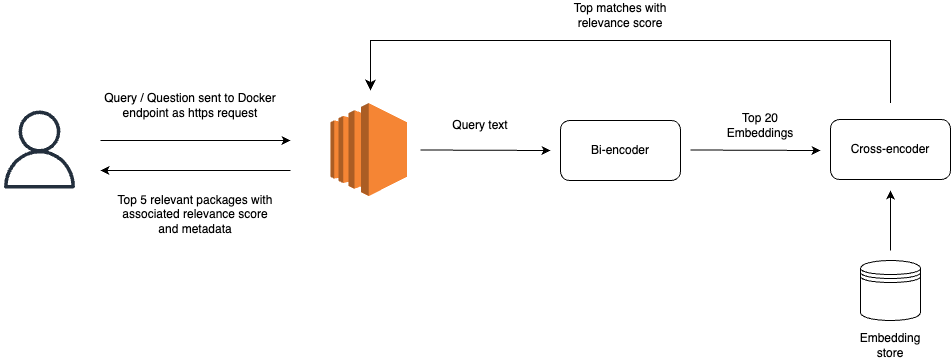

# Epiverse search backend

This project implements a semantic search backend using text embeddings.
It is composed of two primary components:

1. scheduled jobs for data acquisition and embedding generation
2. a FastAPI service for querying the embedded knowledge base.

This README describes the repository structure and the basic properties of each component.

For installation instructions and runtime configuration, please refer to the [project wiki](https://github.com/epiverse-connect/epiverse-search-backend/wiki).

## Scheduled Jobs (`jobs/`)

This folder contains two independent jobs that run on a schedule to each acquire the data and
pre-process it for the semantic search engine.

Both these jobs are:

- Triggered on a monthly schedule
- Stateless: each run is independent from the previous ones, and from the other components of this codebase

They can both be run locally by running the file with the `_locally.py` suffix, or via Azure Functions, with the files provided in the `_azure/` subfolder. When running on Azure Functions, it is directly integrated to Azure Blob Storage to save the output files there.

### "Calculate embeddings" component (stored in `jobs/calculate-embeddings`)

This component gets the documentation files for all the tools in the Epiverse ecosystem (with [epiverse-scraper](https://github.com/epiverse-connect/epiverse-scraper)), tokenize their contents, and convert them into embeddings with the multi-qa-MiniLM-L6-cos-v1 language model.
It has the following characteristics:

- Runtime: python (+ R as a subprocess invoked from python)
- Outputs:
  - `analysis_df.csv`: Preprocessed text from documentation files (~10 MB)
  - `corpus_embeddings.pth`: Binary file containing vector embeddings (~1 MB)

### "Fetch universe metadata" component (stored in`jobs/fetch-universe-metadata`)

This component gets the metadata (source location, author names, link to documentation website, etc.) of all the tools in the Epiverse ecosystem.
It has the following characteristics:

- Runtime: python
- Outputs:
  - `metadata.json`: Tool metadata including names, authors, and source URLs (~150 KB)

## REST API in `app/` folder

This component exposes a FastAPI-based HTTP endpoint that accepts user search queries and returns ranked results based on semantic similarity.

- Runtime: python
- Inputs (dependencies):
  - `metadata.json`: Tool metadata
  - `corpus_embeddings.pth`: Semantic vector space
  - `analysis_df.csv`: Token and document info

